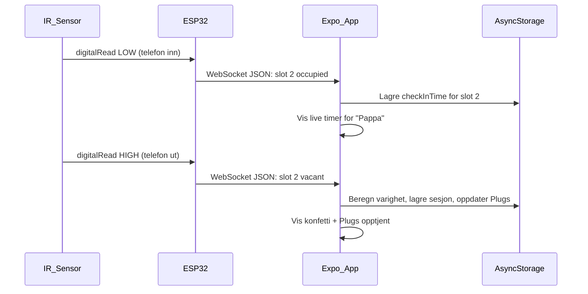

# Unplug Mobilhotell -- Fullstendig byggeplan

## Konsept

Et fysisk mobilhotell i Unnecessary Inventions-stil: litt overengineered, morsomt, fargerikt, men faktisk funksjonelt. 5 slotter (en per familiemedlem), IR-sensorer som registrerer telefon inn/ut, ESP32 som sender data til appen over WiFi/WebSocket i sanntid.

---

## Del 1: Fysisk design -- "The Unplugger 3000"

Tenk Unnecessary Inventions: gi det et absurd navn, lag det litt for bra, men hold det DIY.

### Formfaktor

- En rektangulær "hotellresepsjon" i tre/MDF/akryl, med 5 vertikale slotter
- Hver slot er ca. **12 cm bred x 2 cm dyp x 18 cm hoy** (passer alle telefoner med deksel)
- Totalstorrelse: ca. **65 cm bred x 20 cm dyp x 22 cm hoy** (inkl. base)
- Basen skjuler all elektronikk (ESP32, kabler, USB-hub for lading)

### Designdetaljer i Unnecessary Inventions-stil

- **Neonskilt** pa toppen: "THE UNPLUGGER 3000" (LED-stripe bak akryl, eller bare malt tekst)
- **Navneskilt per slot**: smaa "romnummer"-skilt som pa et ekte hotell -- "Room 1: Mamma", "Room 2: Pappa", etc. Laminerte kort eller gravert i tre
- **Minibar-vibe**: Male eller foliere innsiden av slottene i Unplug Green (#2DC653)
- **LED per slot**: en liten grenn/rod LED ved hver slot som indikerer status (valgfritt men goy)
- **"Do Not Disturb"-skilt**: et lite hengende skilt pa slotten nar telefonen er sjekket inn
- **Ropt stempel**: "PHONE FREE ZONE" stemplet pa forsiden

### Materialer for kassettet

- MDF-plate eller kryssfiner (3-5mm) -- kan kuttes med stiksag eller laserkutter
- Alternativt: 3D-print slottdelene, treplater for base
- Trelim + skruer
- Maling i Unplug-fargene (gron, gul, hvit)
- Eventuelt kontaktpapir/folie

---

## Del 2: Handleliste (elektronikk)

### Hovedkomponenter

- 1x **ESP32 DevKit v1** (30-pin) -- ~70 kr -- hjernen i systemet
- 5x **IR break-beam sensor** (TCRT5000 eller tilsvarende refleksjonsmodul) -- ~15 kr/stk = ~75 kr
- 1x **Breadboard** (830 hull) -- ~25 kr (for prototyping)
- 1x **Jumper-kabler** (hun-hun + han-hun, 40-pack) -- ~20 kr
- 1x **Micro-USB kabel** -- har sikkert allerede
- 1x **USB-lader** (5V, minst 1A) -- har sikkert allerede

### Valgfritt (for extra flair)

- 5x **LED** (gron) + 5x motstand (220 ohm) -- ~15 kr -- statuslys per slot
- 1x **LED-stripe** (WS2812B, 30cm) -- ~40 kr -- for "neonskilt"-effekten
- 1x **5-port USB-hub** -- ~60 kr -- for a lade telefonene i hotellet
- 5x **kort USB-kabel** (15-20cm) -- ~50 kr -- en per slot

### Hvor handle

- **AliExpress**: billigst, 2-3 ukers levering (ESP32, IR-sensorer, LEDs, kabler)
- **Electrokit.com** (svensk): rask levering til Norge, litt dyrere
- **Kjell & Company**: har ESP32 og breadboard i butikk, dyrest men instant
- **Amazon.de**: bra mellomting pa pris/levering

### Estimert totalkostnad

- Minimumversjon (ESP32 + 5 IR + kabler): **~190 kr**
- Full versjon (med LEDs, lading, stripe): **~350 kr**
- Kasseett/materialer: **~50-150 kr** avhengig av hva dere har hjemme

---

## Del 3: ESP32-firmware (Arduino)

ESP32 kobler til hjemme-WiFi og kjorer en WebSocket-server. Hver IR-sensor er koblet til en egen GPIO-pin.

### Pin-oppsett (5 sensorer)

```
Slot 1 -> GPIO 13
Slot 2 -> GPIO 14
Slot 3 -> GPIO 27
Slot 4 -> GPIO 26
Slot 5 -> GPIO 25
```

Alle sensorer deler VCC (3.3V) og GND.

### Firmware-logikk

```
1. Koble til WiFi
2. Start WebSocket-server pa port 81
3. Hvert 500ms: les alle 5 GPIO-pinner
4. Hvis status endres (telefon inn eller ut):
     -> Send JSON til alle tilkoblede klienter:
        { "slot": 2, "occupied": true, "timestamp": 1712073600 }
5. Pa forespørsel "getStatus":
     -> Send full status for alle 5 slotter
```

### Biblioteker (Arduino IDE)

- `WiFi.h` (innebygd)
- `ESPAsyncWebServer` + `AsyncTCP`
- `ArduinoJson`

Firmware-koden lages som en egen fil: `hardware/firmware/mobilhotell.ino`.

---

## Del 4: Expo-app -- nye filer og endringer

### Nye pakker

- `@react-native-async-storage/async-storage` -- lagre sesjoner, bruker-slot-mapping, Plugs

### Nye filer

- `[lib/websocket.ts](lib/websocket.ts)` -- WebSocket-klient som kobler til ESP32. Reconnect-logikk, parser JSON-meldinger, eksponerer hooks.
- `[lib/storage.ts](lib/storage.ts)` -- AsyncStorage-wrapper for sesjoner, slot-mapping, Plugs-saldo.
- `[lib/types.ts](lib/types.ts)` -- TypeScript-typer: `Slot`, `Session`, `FamilyMember`, `HotelStatus`.
- `[app/(tabs)/index.tsx](app/(tabs)/index.tsx)` -- omskrives: Dashboard med 5 slotter, live-status, aktiv sesjon-timer, Plugs-teller.
- `[app/(tabs)/history.tsx](app/(tabs)/history.tsx)` -- ny tab: sesjonshistorikk, statistikk, streaks.
- `[app/(tabs)/settings.tsx](app/(tabs)/settings.tsx)` -- ny tab: konfigurer ESP32 IP-adresse, tildel familiemedlemmer til slotter.
- `[app/(tabs)/_layout.tsx](app/(tabs)/_layout.tsx)` -- oppdateres: 3 tabs (Home, History, Settings) i stedet for 2.

### Dataflyt




### Slot-til-bruker-mapping (Alternativ A: faste slotter)

Konfigureres en gang i Settings-tab:

```json
{
  "slots": {
    "1": { "name": "Mamma", "emoji": "👩" },
    "2": { "name": "Pappa", "emoji": "👨" },
    "3": { "name": "Emma",  "emoji": "👧" },
    "4": { "name": "Noah",  "emoji": "👦" },
    "5": { "name": "Lilly", "emoji": "👶" }
  },
  "esp32_ip": "192.168.1.100"
}
```

---

## Del 5: Rekkefølge

Steg 1 og 2 kan gjores parallelt (app + bestille deler). Steg 3 krever at delene har kommet.

### Steg 1 -- App (kan starte na)

Bygge dashboard med 5 slotter, manuell innsjekk-knapp (fallback), Plugs-beregning, sesjonslagring. Gjor appen brukbar for dag 1 uten hardware.

### Steg 2 -- Bestill deler

Bestill ESP32 + 5x IR-sensor + kabler. Planlegg kasettet.

### Steg 3 -- Hardware (nar deler ankommer)

Koble opp ESP32 + sensorer pa breadboard. Flash firmware. Test med appen.

### Steg 4 -- Bygg kasettet

Sag, lim, mal mobilhotellet. Monter sensorer i slottene. Kabelbehandling.

### Steg 5 -- Integrasjon

Koble alt sammen. Test full flyt: telefon inn -> sensor -> ESP32 -> WebSocket -> app -> Plugs.